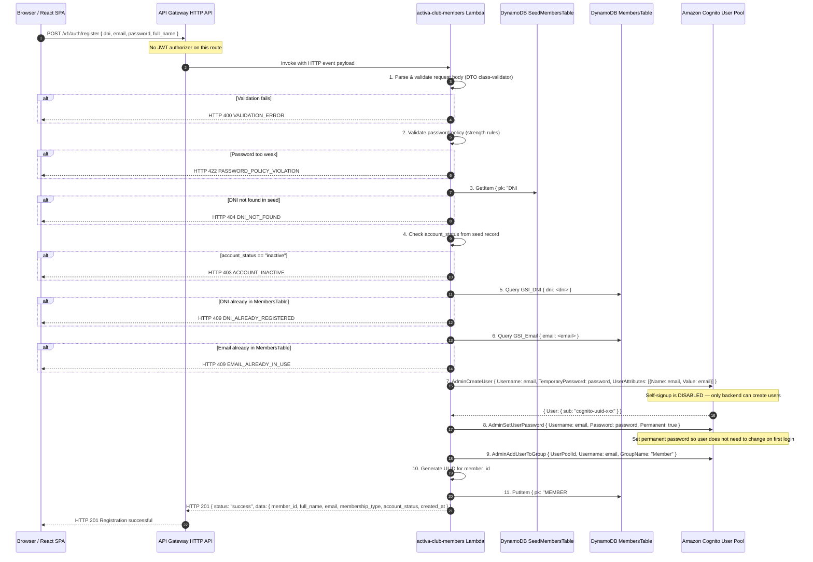

# AC-001 Technical Design: Member Registration via DNI Matching

**Epic:** EP-01 - Member Onboarding
**Story Points:** 8
**Priority:** High
**Status:** Design Complete
**Author:** Senior Software & Cloud Architect
**Date:** 2026-02-20

---

## Table of Contents

1. [Overview](#1-overview)
2. [System Context](#2-system-context)
3. [DynamoDB Table Schema](#3-dynamodb-table-schema)
4. [API Contract](#4-api-contract)
5. [Architecture Flow](#5-architecture-flow)
6. [Lambda Design](#6-lambda-design)
7. [Cognito Configuration](#7-cognito-configuration)
8. [Security Considerations](#8-security-considerations)
9. [Infrastructure (Terraform)](#9-infrastructure-terraform)
10. [Frontend Changes](#10-frontend-changes)
11. [Open Questions](#11-open-questions)

---

## 1. Overview

This document describes the technical design for **AC-001: Member Registration via DNI Matching**, the entry point for all member lifecycle flows in ActivaClub.

When a prospective member registers, the system must:

1. Validate that their DNI exists in the pre-seeded legacy data table (`SeedMembersTable`).
2. Enforce business rules: block inactive records (`account_status = "inactive"`), reject duplicate DNI or email registrations.
3. Create the authenticated identity in Amazon Cognito (backend-only, self-signup disabled).
4. Persist the member profile in DynamoDB `MembersTable`, inheriting `membership_type` from the seed record.
5. Add the Cognito user to the `Member` group immediately upon creation.
6. Return HTTP 201 with a success body on the happy path.

This story is a prerequisite for AC-002 (Login), AC-003 (Profile), and AC-004 (Membership Payment).

---

## 2. System Context

AC-001 touches the following infrastructure layers:

```
Prospective Member (browser)
        |
        | HTTPS POST /v1/auth/register  [no auth token required]
        v
Amazon CloudFront  -->  React SPA (S3)
        |
        | API call
        v
Amazon API Gateway HTTP API
  - Route: POST /v1/auth/register
  - NO JWT Authorizer on this route (public endpoint)
        |
        v
AWS Lambda: activa-club-members-dev
  [NestJS, Clean Architecture]
        |
        |-- Query -->  DynamoDB: SeedMembersTable  (read-only, DNI lookup)
        |-- Query -->  DynamoDB: MembersTable       (duplicate DNI/email check)
        |-- AdminCreateUser / AdminAddUserToGroup --> Amazon Cognito User Pool
        |-- PutItem --> DynamoDB: MembersTable      (persist member profile)
```

All other ActivaClub routes that require authentication use a Cognito JWT Authorizer attached to API Gateway. The registration route is explicitly excluded from that authorizer.

---

## 3. DynamoDB Table Schema

### 3.1 SeedMembersTable (Pre-loaded Legacy Data)

This table is populated once via a migration script (`scripts/seed-legacy-members`) from the club's on-premise system. It is **read-only** from the application perspective; no Lambda writes to it after the initial seed.

| Property       | Value                         |
|----------------|-------------------------------|
| Table Name     | `SeedMembersTable`            |
| Partition Key  | `pk` (String) — value: `DNI#<dni_number>` |
| Sort Key       | None                          |
| Billing Mode   | PAY_PER_REQUEST (on-demand)   |
| Encryption     | AWS-managed (SSE)             |

**Attributes:**

| Attribute        | Type   | Required | Description                                        |
|------------------|--------|----------|----------------------------------------------------|
| `pk`             | String | Yes      | Partition key. Format: `DNI#<dni_number>`          |
| `dni`            | String | Yes      | National ID number (plain value, e.g., `20345678`) |
| `full_name`      | String | Yes      | Full legal name imported from legacy system        |
| `membership_type`| String | Yes      | Enum: `VIP`, `Gold`, `Silver`                      |
| `account_status` | String | Yes      | Enum: `active`, `inactive`                         |
| `email`          | String | No       | Pre-existing email if available in legacy data     |
| `phone`          | String | No       | Phone number from legacy data                      |
| `imported_at`    | String | Yes      | ISO-8601 timestamp of import                       |

**Access Patterns:**

| Pattern                      | Key used            | Notes                              |
|------------------------------|---------------------|------------------------------------|
| Look up record by DNI number | `pk = DNI#<dni>`   | GetItem — O(1), no GSI needed      |

**No GSIs required** on this table; all lookups are direct GetItem by PK.

---

### 3.2 MembersTable (Application Member Profiles)

This is the primary operational table for member data, written by the `activa-club-members` Lambda.

| Property       | Value                              |
|----------------|------------------------------------|
| Table Name     | `MembersTable`                     |
| Partition Key  | `pk` (String) — value: `MEMBER#<ulid>` |
| Sort Key       | `sk` (String) — value: `PROFILE`   |
| Billing Mode   | PAY_PER_REQUEST (on-demand)        |
| Encryption     | AWS-managed (SSE)                  |
| TTL Attribute  | None (member records are permanent)|

**Attributes:**

| Attribute          | Type   | Required | Description                                                      |
|--------------------|--------|----------|------------------------------------------------------------------|
| `pk`               | String | Yes      | Partition key. Format: `MEMBER#<ulid>`                           |
| `sk`               | String | Yes      | Sort key. Fixed value: `PROFILE`                                 |
| `member_id`        | String | Yes      | ULID — same value as in `pk` (denormalized for query convenience)|
| `dni`              | String | Yes      | National ID number. Unique per member.                           |
| `full_name`        | String | Yes      | Full name inherited from seed record                             |
| `email`            | String | Yes      | Email provided at registration. Unique per member.               |
| `membership_type`  | String | Yes      | Enum: `VIP`, `Gold`, `Silver`. Inherited from `SeedMembersTable`.|
| `account_status`   | String | Yes      | Enum: `active`, `inactive`, `suspended`. Default: `active`.     |
| `cognito_user_id`  | String | Yes      | Cognito `sub` (UUID) returned by `AdminCreateUser`               |
| `created_at`       | String | Yes      | ISO-8601 UTC timestamp of registration                           |
| `updated_at`       | String | Yes      | ISO-8601 UTC timestamp of last update                            |
| `membership_expiry`| String | No       | ISO-8601 date — set when first payment is processed (AC-004)     |
| `phone`            | String | No       | Optional phone number                                            |

**Global Secondary Indexes (GSIs):**

#### GSI_DNI

| Property         | Value                      |
|------------------|----------------------------|
| Index Name       | `GSI_DNI`                  |
| Partition Key    | `dni` (String)             |
| Sort Key         | None                       |
| Projection       | `KEYS_ONLY`                |
| Read Capacity    | On-demand (follows table)  |

**Purpose:** Detect duplicate DNI before creating a new Cognito user. A non-empty result means the DNI is already registered → HTTP 409.

#### GSI_Email

| Property         | Value                      |
|------------------|----------------------------|
| Index Name       | `GSI_Email`                |
| Partition Key    | `email` (String)           |
| Sort Key         | None                       |
| Projection       | `KEYS_ONLY`                |
| Read Capacity    | On-demand (follows table)  |

**Purpose:** Detect duplicate email before creating a new Cognito user. A non-empty result means the email is already in use → HTTP 409.

#### GSI_CognitoSub

| Property         | Value                             |
|------------------|-----------------------------------|
| Index Name       | `GSI_CognitoSub`                  |
| Partition Key    | `cognito_user_id` (String)        |
| Sort Key         | None                              |
| Projection       | `KEYS_ONLY`                       |
| Read Capacity    | On-demand (follows table)         |

**Purpose:** Allow future lookups of member profile by Cognito `sub` from the JWT authorizer context. Used by AC-002 (login profile fetch) and all subsequent authenticated flows.

**Access Patterns Summary:**

| Pattern                              | Operation         | Key / Index           |
|--------------------------------------|-------------------|-----------------------|
| Create member profile                | PutItem           | `pk = MEMBER#<ulid>`, `sk = PROFILE` |
| Get member profile by ID             | GetItem           | `pk`, `sk`            |
| Check if DNI already registered      | Query GSI_DNI     | `dni = <value>`       |
| Check if email already in use        | Query GSI_Email   | `email = <value>`     |
| Get member by Cognito sub (auth)     | Query GSI_CognitoSub | `cognito_user_id = <sub>` |

---

## 4. API Contract

### Endpoint

| Property       | Value                        |
|----------------|------------------------------|
| Method         | `POST`                       |
| Path           | `/v1/auth/register`          |
| Authorization  | None (public route)          |
| Lambda         | `activa-club-members-dev`    |
| Content-Type   | `application/json`           |

### 4.1 Request Headers

| Header           | Required | Value                      |
|------------------|----------|----------------------------|
| `Content-Type`   | Yes      | `application/json`         |
| `X-Request-ID`   | No       | Client-generated UUID for tracing |

### 4.2 Request Body

```json
{
  "dni": "string",
  "email": "string",
  "password": "string",
  "full_name": "string",
  "phone": "string"
}
```

**Field Validation Rules:**

| Field       | Type   | Required | Constraints                                                                 |
|-------------|--------|----------|-----------------------------------------------------------------------------|
| `dni`       | string | Yes      | 7–8 alphanumeric characters (Argentine DNI format). Trim whitespace.        |
| `email`     | string | Yes      | Valid RFC 5322 email address. Max 254 chars. Lowercased before storage.     |
| `password`  | string | Yes      | Min 8 chars. At least 1 uppercase letter, 1 digit, 1 special character.     |
| `full_name` | string | Yes      | 2–100 characters. Overrides seed value if provided; seed value used if omitted. |
| `phone`     | string | No       | E.164 format recommended. Max 20 chars.                                     |

**Example Request:**

```json
{
  "dni": "20345678",
  "email": "martin.garcia@email.com",
  "password": "SecurePass1!",
  "full_name": "Martin Garcia",
  "phone": "+5491112345678"
}
```

### 4.3 Success Response — HTTP 201

```json
{
  "status": "success",
  "data": {
    "member_id": "01JKZP7QR8S9T0UVWX1YZ2AB3C",
    "full_name": "Martin Garcia",
    "email": "martin.garcia@email.com",
    "membership_type": "Gold",
    "account_status": "active",
    "created_at": "2026-02-20T15:30:00.000Z"
  },
  "message": "Registration successful. Please check your email to confirm your account."
}
```

### 4.4 Error Responses

All error responses follow this envelope:

```json
{
  "status": "error",
  "error": {
    "code": "ERROR_CODE",
    "message": "Human-readable message safe for display.",
    "details": []
  }
}
```

#### HTTP 400 — Validation Error (missing/malformed fields)

```json
{
  "status": "error",
  "error": {
    "code": "VALIDATION_ERROR",
    "message": "One or more fields failed validation.",
    "details": [
      { "field": "dni", "issue": "dni is required" },
      { "field": "password", "issue": "password must be at least 8 characters" }
    ]
  }
}
```

#### HTTP 403 — Inactive Account

```json
{
  "status": "error",
  "error": {
    "code": "ACCOUNT_INACTIVE",
    "message": "Your membership is currently inactive. Please contact club administration to resolve any outstanding balance.",
    "details": []
  }
}
```

#### HTTP 404 — DNI Not Found in Seed

```json
{
  "status": "error",
  "error": {
    "code": "DNI_NOT_FOUND",
    "message": "The provided DNI is not registered in our system. Please contact club administration.",
    "details": []
  }
}
```

#### HTTP 409 — Conflict (DNI or Email Already Registered)

**DNI conflict:**

```json
{
  "status": "error",
  "error": {
    "code": "DNI_ALREADY_REGISTERED",
    "message": "An account with this DNI already exists. Please sign in instead.",
    "details": []
  }
}
```

**Email conflict:**

```json
{
  "status": "error",
  "error": {
    "code": "EMAIL_ALREADY_IN_USE",
    "message": "This email address is already associated with an account. Please sign in or use a different email.",
    "details": []
  }
}
```

#### HTTP 422 — Password Policy Violation

```json
{
  "status": "error",
  "error": {
    "code": "PASSWORD_POLICY_VIOLATION",
    "message": "Password does not meet security requirements.",
    "details": [
      { "field": "password", "issue": "Must contain at least 1 uppercase letter" },
      { "field": "password", "issue": "Must contain at least 1 special character" }
    ]
  }
}
```

#### HTTP 500 — Internal Server Error

```json
{
  "status": "error",
  "error": {
    "code": "INTERNAL_ERROR",
    "message": "An unexpected error occurred. Please try again later.",
    "details": []
  }
}
```

**Note:** The 500 response intentionally omits internal stack traces or Cognito/DynamoDB error details to prevent information leakage.

---

## 5. Architecture Flow

The following sequence diagram describes the complete server-side execution path inside the `activa-club-members` Lambda when `POST /v1/auth/register` is invoked.



### Rollback Strategy

Steps 7–11 must be treated as a logical transaction. DynamoDB does not provide cross-service transactions with Cognito. In case of partial failure:

- If `AdminCreateUser` succeeds but `PutItem` to DynamoDB fails: the Lambda must call `AdminDeleteUser` to remove the orphaned Cognito user before returning HTTP 500.
- If `AdminAddUserToGroup` fails: delete the Cognito user and return HTTP 500. The member can retry registration.

---

## 6. Lambda Design

### 6.1 Service Location

```
backend/services/members/
```

### 6.2 Clean Architecture File Structure

```
backend/services/members/
├── src/
│   ├── application/
│   │   └── commands/
│   │       └── register-member/
│   │           ├── register-member.command.ts       # Input contract (plain object)
│   │           ├── register-member.handler.ts       # Use case orchestration logic
│   │           └── register-member.result.ts        # Output contract
│   ├── domain/
│   │   ├── entities/
│   │   │   └── member.entity.ts                    # Member domain entity (rich model)
│   │   ├── value-objects/
│   │   │   ├── dni.vo.ts                           # DNI format validation
│   │   │   ├── membership-type.vo.ts               # Enum: VIP | Gold | Silver
│   │   │   └── account-status.vo.ts                # Enum: active | inactive | suspended
│   │   └── repositories/
│   │       ├── member.repository.interface.ts      # Port: findByDni, findByEmail, save
│   │       └── seed-member.repository.interface.ts # Port: findByDni (read-only)
│   ├── infrastructure/
│   │   ├── repositories/
│   │   │   ├── dynamo-member.repository.ts         # Adapter: MembersTable operations
│   │   │   └── dynamo-seed-member.repository.ts    # Adapter: SeedMembersTable operations
│   │   ├── cognito/
│   │   │   └── cognito.service.ts                  # AdminCreateUser, AdminAddUserToGroup, AdminDeleteUser
│   │   └── handlers/
│   │       └── lambda.handler.ts                   # Entry point — NestJS bootstrap
│   └── presentation/
│       ├── controllers/
│       │   └── auth.controller.ts                  # POST /v1/auth/register route binding
│       └── dtos/
│           ├── register-member.request.dto.ts      # class-validator decorated DTO
│           └── register-member.response.dto.ts     # Response shape
├── test/
│   ├── unit/
│   │   └── register-member.handler.spec.ts         # Unit tests for use case
│   └── integration/
│       └── auth.controller.spec.ts                 # Integration tests (mock DynamoDB/Cognito)
├── package.json
├── tsconfig.json
└── webpack.config.js                               # Bundle for Lambda deployment
```

### 6.3 Key Type Definitions

**register-member.request.dto.ts**

```typescript
import { IsString, IsEmail, IsNotEmpty, MinLength, MaxLength, Matches, IsOptional } from 'class-validator';
import { Transform } from 'class-transformer';

export class RegisterMemberRequestDto {
  @IsString()
  @IsNotEmpty()
  @MinLength(7)
  @MaxLength(8)
  @Matches(/^[0-9A-Za-z]+$/, { message: 'dni must contain only alphanumeric characters' })
  @Transform(({ value }) => value?.trim())
  dni: string;

  @IsEmail()
  @IsNotEmpty()
  @MaxLength(254)
  @Transform(({ value }) => value?.toLowerCase().trim())
  email: string;

  @IsString()
  @IsNotEmpty()
  @MinLength(8)
  @Matches(/^(?=.*[A-Z])(?=.*\d)(?=.*[^A-Za-z0-9]).{8,}$/, {
    message: 'password must contain at least 1 uppercase letter, 1 number, and 1 special character',
  })
  password: string;

  @IsString()
  @IsOptional()
  @MinLength(2)
  @MaxLength(100)
  full_name?: string;

  @IsString()
  @IsOptional()
  @MaxLength(20)
  phone?: string;
}
```

**register-member.handler.ts (use case skeleton)**

```typescript
@Injectable()
export class RegisterMemberHandler {
  constructor(
    private readonly seedMemberRepo: SeedMemberRepositoryInterface,
    private readonly memberRepo: MemberRepositoryInterface,
    private readonly cognitoService: CognitoService,
  ) {}

  async execute(command: RegisterMemberCommand): Promise<RegisterMemberResult> {
    // 1. Look up DNI in seed table
    const seedRecord = await this.seedMemberRepo.findByDni(command.dni);
    if (!seedRecord) throw new DniNotFoundException();

    // 2. Enforce account_status
    if (seedRecord.accountStatus === 'inactive') throw new AccountInactiveException();

    // 3. Check DNI uniqueness in MembersTable
    const existingByDni = await this.memberRepo.findByDni(command.dni);
    if (existingByDni) throw new DniAlreadyRegisteredException();

    // 4. Check email uniqueness in MembersTable
    const existingByEmail = await this.memberRepo.findByEmail(command.email);
    if (existingByEmail) throw new EmailAlreadyInUseException();

    // 5. Create Cognito user (permanent password)
    let cognitoSub: string;
    try {
      cognitoSub = await this.cognitoService.adminCreateUser(command.email, command.password);
      await this.cognitoService.adminAddUserToGroup(command.email, 'Member');
    } catch (cognitoError) {
      // Rollback: delete Cognito user if group assignment fails
      await this.cognitoService.adminDeleteUser(command.email).catch(() => {});
      throw cognitoError;
    }

    // 6. Persist member profile
    const memberId = ulid();
    const now = new Date().toISOString();
    const member = new MemberEntity({
      memberId,
      dni: command.dni,
      fullName: command.full_name ?? seedRecord.fullName,
      email: command.email,
      phone: command.phone,
      membershipType: seedRecord.membershipType,
      accountStatus: 'active',
      cognitoUserId: cognitoSub,
      createdAt: now,
      updatedAt: now,
    });

    try {
      await this.memberRepo.save(member);
    } catch (dbError) {
      // Rollback: delete Cognito user if DynamoDB write fails
      await this.cognitoService.adminDeleteUser(command.email).catch(() => {});
      throw dbError;
    }

    return new RegisterMemberResult(member);
  }
}
```

### 6.4 Domain Exceptions (mapped by global exception filter)

| Exception Class              | HTTP Status | Error Code                  |
|------------------------------|-------------|-----------------------------|
| `DniNotFoundException`       | 404         | `DNI_NOT_FOUND`             |
| `AccountInactiveException`   | 403         | `ACCOUNT_INACTIVE`          |
| `DniAlreadyRegisteredException` | 409      | `DNI_ALREADY_REGISTERED`    |
| `EmailAlreadyInUseException` | 409         | `EMAIL_ALREADY_IN_USE`      |
| `ValidationException`        | 400         | `VALIDATION_ERROR`          |
| `PasswordPolicyException`    | 422         | `PASSWORD_POLICY_VIOLATION` |

These exceptions are defined in `backend/libs/errors/` and caught by a NestJS global exception filter that maps them to the standard error envelope.

---

## 7. Cognito Configuration

### 7.1 User Pool Settings Relevant to AC-001

| Setting                          | Value                                     | Rationale                                               |
|----------------------------------|-------------------------------------------|---------------------------------------------------------|
| `allow_self_registration`        | `false`                                   | Only the backend Lambda may create users via AdminAPI   |
| `username_attributes`            | `["email"]`                               | Email is the login identifier                           |
| `auto_verified_attributes`       | `["email"]`                               | Cognito sends verification email automatically          |
| `mfa_configuration`              | `OFF`                                     | MFA deferred to post-MVP security story                 |
| `account_recovery_setting`       | Email only                                | Password reset via email link                           |

### 7.2 Password Policy

| Rule                    | Value |
|-------------------------|-------|
| Minimum length          | 8     |
| Require uppercase       | Yes   |
| Require lowercase       | Yes   |
| Require numbers         | Yes   |
| Require symbols         | Yes   |
| Temporary password validity | 7 days (not used — permanent password set immediately) |

### 7.3 Cognito Groups

| Group Name | Description                                      | Precedence |
|------------|--------------------------------------------------|------------|
| `Admin`    | Full platform access                             | 1          |
| `Manager`  | Promotions + analytics access                   | 2          |
| `Member`   | Standard member access (reservations, guests...) | 3          |

AC-001 adds every successfully registered user to the `Member` group via `AdminAddUserToGroup`.

### 7.4 API Calls Made by Lambda

| Cognito API Call          | When Called                              | Parameters                                                  |
|---------------------------|------------------------------------------|-------------------------------------------------------------|
| `AdminCreateUser`         | After all validations pass               | `Username: email`, `TemporaryPassword: password`, `UserAttributes: [{Name: "email", Value: email}]`, `MessageAction: "SUPPRESS"` (optional: suppress welcome email for custom flow) |
| `AdminSetUserPassword`    | Immediately after `AdminCreateUser`      | `Username: email`, `Password: password`, `Permanent: true`  |
| `AdminAddUserToGroup`     | After password set                       | `GroupName: "Member"`, `Username: email`                    |
| `AdminDeleteUser`         | On rollback (partial failure)            | `Username: email`                                           |

**Note on `MessageAction: "SUPPRESS"`:** If the club uses a custom welcome email via SNS or SES in a future story, set `MessageAction: "SUPPRESS"` on `AdminCreateUser` to prevent Cognito's default temporary-password email. If Cognito's built-in email is the intended channel, omit this flag. This is captured as an open question in Section 11.

### 7.5 IAM Permissions Required by Lambda Execution Role

```
cognito-idp:AdminCreateUser
cognito-idp:AdminSetUserPassword
cognito-idp:AdminAddUserToGroup
cognito-idp:AdminDeleteUser
cognito-idp:ListUsersInGroup
```

Scoped to the specific User Pool ARN only (least privilege).

---

## 8. Security Considerations

### 8.1 Input Sanitization

- All string inputs are trimmed of leading/trailing whitespace via `class-transformer` `@Transform`.
- Email is lowercased before any comparison or storage.
- DNI is matched case-insensitively (normalize to uppercase before lookup if alphanumeric DNIs are supported).
- No raw HTML or script content is accepted; the `ValidationPipe` with `whitelist: true` strips unknown properties.

### 8.2 Error Response Hardening

- Error messages must **never** reveal internal implementation details (table names, Lambda ARNs, stack traces).
- The `DNI_NOT_FOUND` and `ACCOUNT_INACTIVE` errors intentionally use vague phrasing ("contact administration") to prevent enumeration of member status by external actors.
- HTTP 500 responses return only a generic message.

### 8.3 Rate Limiting

- API Gateway throttling should be configured at the stage level: default 100 req/s burst, 50 req/s steady-state.
- The `/v1/auth/register` route can be additionally throttled to 10 req/s to mitigate registration abuse.
- Optionally, AWS WAF can be attached to API Gateway with a rate-based rule for the registration path. **Note:** AWS WAF incurs cost beyond Free Tier (~$5/month minimum); escalate to PO before enabling.

### 8.4 Password Handling

- The password is **never stored** by the Lambda or in DynamoDB. It is transmitted directly to Cognito via `AdminCreateUser` / `AdminSetUserPassword` over TLS.
- Lambda logs must be configured to **redact** the `password` field. Use AWS Lambda Powertools logger with a custom redaction pattern.

### 8.5 DNI as Sensitive Data

- The `SeedMembersTable` contains PII (DNI, full name). IAM policies must restrict read access to the `activa-club-members` Lambda execution role only.
- Enable DynamoDB encryption at rest (AWS-managed key) for both `SeedMembersTable` and `MembersTable`.
- Enable AWS CloudTrail for all DynamoDB API calls on these tables.

### 8.6 Cognito Client Configuration

- The Cognito App Client used by the frontend must **not** have the `AdminCreateUser` permission. All admin API calls are made from the Lambda using the Lambda execution role's IAM credentials, not client credentials.
- The App Client must enable `USER_PASSWORD_AUTH` flow only (not `ALLOW_USER_SRP_AUTH` at minimum for MVP; SRP is preferred long-term).

---

## 9. Infrastructure (Terraform)

All resources below reside in `infrastructure/envs/dev/` and reference reusable modules from `infrastructure/modules/`.

### 9.1 New Resources for AC-001

#### DynamoDB — SeedMembersTable

```hcl
# Module call: infrastructure/modules/dynamodb/
module "seed_members_table" {
  source      = "../../modules/dynamodb"
  table_name  = "SeedMembersTable"
  billing_mode = "PAY_PER_REQUEST"

  hash_key = "pk"
  attributes = [
    { name = "pk", type = "S" }
  ]

  tags = {
    Environment = var.env
    Service     = "members"
    ManagedBy   = "terraform"
  }
}
```

#### DynamoDB — MembersTable

```hcl
module "members_table" {
  source      = "../../modules/dynamodb"
  table_name  = "MembersTable"
  billing_mode = "PAY_PER_REQUEST"

  hash_key  = "pk"
  range_key = "sk"

  attributes = [
    { name = "pk",               type = "S" },
    { name = "sk",               type = "S" },
    { name = "dni",              type = "S" },
    { name = "email",            type = "S" },
    { name = "cognito_user_id",  type = "S" },
  ]

  global_secondary_indexes = [
    {
      name            = "GSI_DNI"
      hash_key        = "dni"
      projection_type = "KEYS_ONLY"
    },
    {
      name            = "GSI_Email"
      hash_key        = "email"
      projection_type = "KEYS_ONLY"
    },
    {
      name            = "GSI_CognitoSub"
      hash_key        = "cognito_user_id"
      projection_type = "KEYS_ONLY"
    }
  ]

  tags = {
    Environment = var.env
    Service     = "members"
    ManagedBy   = "terraform"
  }
}
```

#### Lambda — activa-club-members

```hcl
module "members_lambda" {
  source        = "../../modules/lambda"
  function_name = "activa-club-members-${var.env}"
  handler       = "dist/infrastructure/handlers/lambda.handler"
  runtime       = "nodejs20.x"
  memory_size   = 256
  timeout       = 15
  source_path   = "../../../backend/services/members"

  environment_variables = {
    ENV                   = var.env
    DYNAMODB_REGION       = var.aws_region
    MEMBERS_TABLE_NAME    = module.members_table.table_name
    SEED_MEMBERS_TABLE_NAME = module.seed_members_table.table_name
    COGNITO_USER_POOL_ID  = module.cognito.user_pool_id
    COGNITO_CLIENT_ID     = module.cognito.app_client_id
  }

  iam_policy_statements = [
    # DynamoDB permissions
    {
      effect    = "Allow"
      actions   = ["dynamodb:GetItem", "dynamodb:Query"]
      resources = [module.seed_members_table.table_arn]
    },
    {
      effect    = "Allow"
      actions   = ["dynamodb:GetItem", "dynamodb:Query", "dynamodb:PutItem"]
      resources = [
        module.members_table.table_arn,
        "${module.members_table.table_arn}/index/*"
      ]
    },
    # Cognito Admin permissions
    {
      effect  = "Allow"
      actions = [
        "cognito-idp:AdminCreateUser",
        "cognito-idp:AdminSetUserPassword",
        "cognito-idp:AdminAddUserToGroup",
        "cognito-idp:AdminDeleteUser",
      ]
      resources = [module.cognito.user_pool_arn]
    }
  ]

  tags = {
    Environment = var.env
    Service     = "members"
    ManagedBy   = "terraform"
  }
}
```

#### API Gateway — Route (public, no authorizer)

```hcl
# Inside the api-gateway module or env overlay:
resource "aws_apigatewayv2_route" "register" {
  api_id             = module.api_gateway.api_id
  route_key          = "POST /v1/auth/register"
  target             = "integrations/${module.members_lambda.apigw_integration_id}"
  # authorization_type intentionally omitted (defaults to NONE — public route)
}
```

#### Cognito — User Pool (relevant settings)

```hcl
module "cognito" {
  source    = "../../modules/cognito"
  user_pool_name = "activa-club-${var.env}"

  password_policy = {
    minimum_length    = 8
    require_uppercase = true
    require_lowercase = true
    require_numbers   = true
    require_symbols   = true
  }

  allow_self_registration = false
  auto_verified_attributes = ["email"]
  username_attributes      = ["email"]

  groups = [
    { name = "Admin",   precedence = 1 },
    { name = "Manager", precedence = 2 },
    { name = "Member",  precedence = 3 },
  ]
}
```

### 9.2 Free Tier Impact Assessment

| Resource                   | Free Tier Limit                  | AC-001 Impact           | Risk  |
|----------------------------|----------------------------------|-------------------------|-------|
| DynamoDB (on-demand)       | 25 WCU / 25 RCU (provisioned) or 1M requests/month (on-demand) | Very low for dev        | Low   |
| Lambda                     | 1M invocations / month           | Very low for dev        | Low   |
| API Gateway HTTP API       | 1M API calls / month             | Very low for dev        | Low   |
| Cognito User Pool          | 50,000 MAU free                  | Well within dev limits  | Low   |
| CloudWatch Logs            | 5 GB ingestion free              | Monitor log verbosity   | Low   |

No paid services are introduced by AC-001.

---

## 10. Frontend Changes

### 10.1 New Page

**Path:** `frontend/src/pages/auth/RegisterPage.tsx`

**Route:** `/register` (public, no auth required)

### 10.2 Component Structure

```
frontend/src/pages/auth/
└── RegisterPage.tsx          # Page wrapper, form orchestration

frontend/src/components/auth/
├── RegisterForm.tsx           # Controlled form component
└── PasswordStrengthIndicator.tsx  # Visual password strength feedback

frontend/src/api/
└── auth.api.ts               # POST /v1/auth/register API call
```

### 10.3 Form Fields

| Field         | Input Type | Validation (client-side)                                      |
|---------------|------------|---------------------------------------------------------------|
| DNI           | text       | Required, 7–8 chars, alphanumeric                             |
| Full Name     | text       | Optional, 2–100 chars                                         |
| Email         | email      | Required, valid email format                                  |
| Password      | password   | Required, min 8 chars, pattern check                          |
| Phone         | tel        | Optional, E.164 format hint                                   |

### 10.4 Error Code to User Message Mapping

| API Error Code              | User-facing Message (Spanish for UI)                                                    |
|-----------------------------|-----------------------------------------------------------------------------------------|
| `VALIDATION_ERROR`          | Display per-field inline errors from `details[]`                                        |
| `PASSWORD_POLICY_VIOLATION` | "La contraseña no cumple los requisitos. Debe tener al menos 8 caracteres, 1 mayúscula, 1 número y 1 caracter especial." |
| `DNI_NOT_FOUND`             | "Tu DNI no está registrado en el sistema. Por favor, contactá a la administración."     |
| `ACCOUNT_INACTIVE`          | "Tu membresía se encuentra inactiva. Contactá a la administración para regularizar."    |
| `DNI_ALREADY_REGISTERED`    | "Ya existe una cuenta con este DNI. Por favor, iniciá sesión."                          |
| `EMAIL_ALREADY_IN_USE`      | "Este email ya está asociado a una cuenta. Iniciá sesión o usá otro email."             |
| `INTERNAL_ERROR`            | "Ocurrió un error inesperado. Por favor, intentá de nuevo más tarde."                   |

### 10.5 State Management

- Form state: React Hook Form (or controlled state; align with team preference).
- API call: React Query `useMutation` via `auth.api.ts`.
- On success (HTTP 201): redirect to `/login` with a success toast notification.
- Auth store (Zustand): not updated during registration — the member must log in separately after registration.

### 10.6 Router Configuration

```
frontend/src/router/index.tsx
  - Add <Route path="/register" element={<RegisterPage />} /> as a public route
  - Wrap with PublicOnlyRoute guard (redirect to /dashboard if already authenticated)
```

---

## 11. Open Questions

| # | Question | Owner | Impact |
|---|----------|-------|--------|
| 1 | **Cognito welcome email:** Should `AdminCreateUser` suppress the Cognito-generated welcome email (`MessageAction: "SUPPRESS"`) in favor of a custom SES/SNS email in a future story, or should Cognito's built-in email be used for MVP? | PO / Admin | Affects Cognito call parameters and email UX |
| 2 | **DNI format:** Is the Argentine DNI always 7–8 numeric digits, or can it include letters (e.g., for foreign nationals)? The current regex `/^[0-9A-Za-z]+$/` is permissive. Should validation be tightened to digits only? | PO / Business | Affects DTO validation and seed data format |
| 3 | **`full_name` source of truth:** If the member provides a `full_name` in the request that differs from the seed record, which takes precedence? Current design favors the request value (member may have updated their name), falling back to seed if omitted. | PO | Affects data consistency with legacy records |
| 4 | **Seed record cleanup:** Should a successfully registered member's seed record be marked or deleted after onboarding to prevent re-use attempts? Or should `SeedMembersTable` remain immutable after import? | Architect / PO | Affects SeedMembersTable write permissions for members Lambda |
| 5 | **Rate limiting / WAF:** Is AWS WAF within budget for dev? If not, API Gateway throttling alone is sufficient for MVP. | PO / Budget | Cost impact: ~$5/month minimum for WAF |
| 6 | **Email verification flow:** After `AdminCreateUser`, Cognito can send a verification link. Should the member be required to verify their email before being able to log in (AC-002), or is verification optional for MVP? | PO | Affects Cognito `email_verified` attribute handling |
| 7 | **`SeedMembersTable` in same AWS account/region:** Is the seed table always co-located with the application DynamoDB tables, or does the legacy import process write to a different AWS account? | DevOps | Affects IAM and VPC configuration |

---

*Document maintained by the Senior Software & Cloud Architect agent. Review required before implementation begins.*
