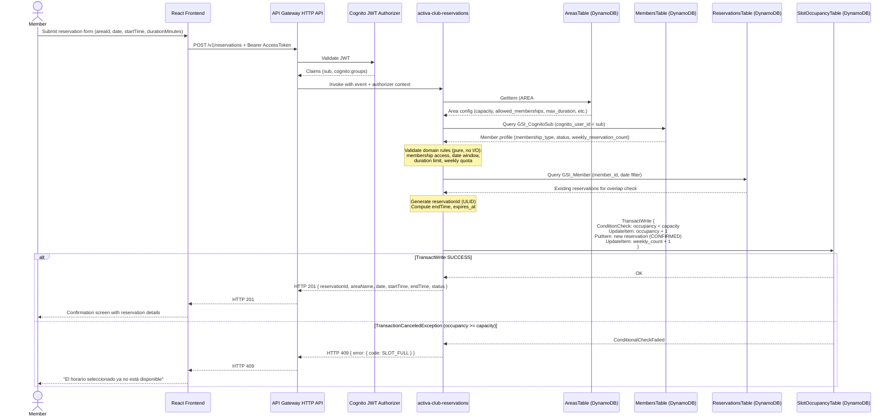

# EP-02 Technical Design: Reservations

**Epic:** EP-02 - Reservas
**Stories Covered:** AC-011, AC-012, AC-013, AC-014, AC-015, AC-016
**Story Points:** 25 (3 + 8 + 3 + 3 + 5 + 3)
**Priority:** High
**Status:** Design — Ready for Implementation
**Author:** Senior Software & Cloud Architect
**Date:** 2026-04-05

---

## Table of Contents

1. [Overview](#1-overview)
2. [DynamoDB Table Schema](#2-dynamodb-table-schema)
3. [API Contract](#3-api-contract)
4. [Lambda Design](#4-lambda-design)
5. [Security Considerations](#5-security-considerations)
6. [Infrastructure (Terraform)](#6-infrastructure-terraform)
7. [Frontend Changes](#7-frontend-changes)
8. [Open Questions](#8-open-questions)

---

## 1. Overview

EP-02 delivers the full reservation lifecycle for ActivaClub:

| Story  | Capability                                | Lambda                                   |
|--------|-------------------------------------------|------------------------------------------|
| AC-011 | Area availability query (by date + slot)  | `activa-club-reservations`               |
| AC-012 | Member creates a reservation              | `activa-club-reservations`               |
| AC-013 | Member cancels own reservation            | `activa-club-reservations`               |
| AC-014 | Member views own reservation list         | `activa-club-reservations`               |
| AC-015 | Manager views calendar, cancels, blocks   | `activa-club-reservations`               |
| AC-016 | Automatic expiration via EventBridge      | `activa-club-reservations-expirer` (new) |

All endpoints in AC-011 through AC-015 are served by a single Lambda (`activa-club-reservations`), which already has its skeleton in place. AC-016 is a new, purpose-built Lambda invoked exclusively by EventBridge Scheduler.

### Key Design Decisions

**Slot-based occupancy tracking (SlotOccupancyTable):** Rather than scanning all reservations to count occupancy on each availability query, a dedicated `SlotOccupancyTable` maintains a real-time counter per `areaId + date + startTime`. This counter is incremented/decremented atomically as part of every reservation `TransactWrite`. This keeps AC-011 `GET` cost at O(1) per slot instead of O(n reservations).

**Weekly quota tracking on MembersTable:** The member profile (`MembersTable`) carries two fields: `weeklyReservationCount` (current count) and `weeklyResetAt` (ISO-8601 timestamp of the next Monday 00:00 UTC). On every reservation creation or cancellation, the Lambda checks whether `weeklyResetAt` has passed and resets the counter before applying the operation. This avoids a separate counter table and is idempotent.

**`AreaBlocksTable` as a separate table:** Manager-created slot blocks are stored separately from reservations. This keeps the `ReservationsTable` clean and lets availability queries scan both sources independently without over-complicating GSI projections.

**Concurrency control via `TransactWrite` with `ConditionCheck`:** AC-012 creates the reservation and increments the slot occupancy counter in a single `TransactWrite`. The transaction includes a condition `occupancy < capacity` on `SlotOccupancyTable`. A concurrent request that would push occupancy over capacity will fail with `TransactionCanceledException` (reason: `ConditionalCheckFailed`), which the Lambda maps to `HTTP 409 SLOT_FULL`.

**Reservation status lifecycle:**

```
CONFIRMED  -->  CANCELLED  (by member AC-013, or manager AC-015)
CONFIRMED  -->  EXPIRED    (by expirer AC-016)
```

`ACTIVE` status (in-progress) is intentionally excluded from the MVP scope (see AC-016 out-of-scope note). The expirer transitions `CONFIRMED → EXPIRED` once `endTime` has passed.

---

## 2. DynamoDB Table Schema

### 2.1 ReservationsTable (updated schema)

The existing README schema uses `PK = RESERVATION#<id>` and `SK = MEMBER#<id>`. This design formalizes and extends it.

| Property      | Value                                      |
|---------------|--------------------------------------------|
| Table Name    | `ReservationsTable`                        |
| Partition Key | `pk` (String) — `RESERVATION#<ulid>`       |
| Sort Key      | `sk` (String) — `MEMBER#<memberId>`        |
| Billing Mode  | PAY_PER_REQUEST                            |

**Attributes:**

| Attribute             | Type   | Required | Description                                                          |
|-----------------------|--------|----------|----------------------------------------------------------------------|
| `pk`                  | String | Yes      | `RESERVATION#<ulid>`                                                 |
| `sk`                  | String | Yes      | `MEMBER#<memberId>` (memberId = ULID from MembersTable)              |
| `reservation_id`      | String | Yes      | ULID (denormalized from pk)                                          |
| `member_id`           | String | Yes      | ULID (denormalized from sk)                                          |
| `area_id`             | String | Yes      | ULID — FK to AreasTable                                              |
| `area_name`           | String | Yes      | Denormalized for display (avoids cross-table read in list queries)   |
| `date`                | String | Yes      | `YYYY-MM-DD`                                                         |
| `start_time`          | String | Yes      | `HH:MM` (24h)                                                        |
| `end_time`            | String | Yes      | `HH:MM` (24h) — derived: `start_time + duration_minutes`            |
| `duration_minutes`    | Number | Yes      | Integer. Constrained by membership type at write time.               |
| `status`              | String | Yes      | Enum: `CONFIRMED`, `CANCELLED`, `EXPIRED`                            |
| `cancel_reason`       | String | No       | Free text. Set by manager on AC-015 cancellation.                    |
| `cancelled_by_role`   | String | No       | `MEMBER` or `MANAGER`. Set on cancellation.                          |
| `created_at`          | String | Yes      | ISO-8601 UTC                                                         |
| `updated_at`          | String | Yes      | ISO-8601 UTC                                                         |
| `expires_at`          | String | Yes      | ISO-8601 UTC datetime of `date + end_time` (used by expirer query)   |

**Global Secondary Indexes:**

#### GSI_Member

| Property      | Value                  |
|---------------|------------------------|
| Index Name    | `GSI_Member`           |
| PK            | `member_id` (String)   |
| SK            | `created_at` (String)  |
| Projection    | `ALL`                  |

**Purpose:** AC-014 — list all reservations for the authenticated member, sorted by creation date. Filter by `status` client-side or with `FilterExpression` after query.

#### GSI_AreaDate

| Property      | Value                        |
|---------------|------------------------------|
| Index Name    | `GSI_AreaDate`               |
| PK            | `area_id` (String)           |
| SK            | `date` (String)              |
| Projection    | `ALL`                        |

**Purpose:** AC-015 — list all reservations for a given area on a given date (manager calendar view). Also used by the expirer to enumerate confirmed reservations for an area on past dates (secondary path).

#### GSI_StatusExpires

| Property      | Value                     |
|---------------|---------------------------|
| Index Name    | `GSI_StatusExpires`       |
| PK            | `status` (String)         |
| SK            | `expires_at` (String)     |
| Projection    | `KEYS_ONLY`               |

**Purpose:** AC-016 expirer — query `status = CONFIRMED` AND `expires_at <= <now_iso>` to find all reservations that need expiration. `KEYS_ONLY` keeps the index lean; the expirer fetches full items by PK+SK only for those matched.

**Access Patterns Summary:**

| Pattern                                           | Operation       | Key / Index              |
|---------------------------------------------------|-----------------|--------------------------|
| Get reservation by ID                             | GetItem         | `pk`, `sk` (needs memberId — use GSI or store both) |
| Get reservation by ID (no memberId known)         | Query GSI       | `reservation_id` via new GSI_ReservationId (see note) |
| List member's reservations (all statuses)         | Query GSI_Member | `member_id = <id>`      |
| List reservations for area on date                | Query GSI_AreaDate | `area_id + date`      |
| Find expired-but-still-CONFIRMED reservations     | Query GSI_StatusExpires | `status = CONFIRMED AND expires_at <= now` |

> **Note on GetItem by reservationId:** The PK is `RESERVATION#<id>` but SK is `MEMBER#<memberId>`, which is not known in all call sites (e.g., manager cancellation by reservationId only). Two approaches: (a) add a sparse GSI on `reservation_id` projecting `pk` + `sk`; (b) store `member_id` in the URL response and require callers to pass it. **Recommended: add `GSI_ReservationId`** (PK: `reservation_id`, KEYS_ONLY) to avoid API ergonomics issues.

#### GSI_ReservationId

| Property      | Value                       |
|---------------|-----------------------------|
| Index Name    | `GSI_ReservationId`         |
| PK            | `reservation_id` (String)   |
| SK            | None                        |
| Projection    | `KEYS_ONLY`                 |

**Purpose:** Resolve `reservationId → (pk, sk)` for GetItem in manager cancel and member cancel endpoints where only `reservationId` is known from the path parameter.

---

### 2.2 SlotOccupancyTable (new)

Stores the real-time occupancy counter per area+date+slot. Written atomically with reservations in `TransactWrite`.

| Property      | Value                                              |
|---------------|----------------------------------------------------|
| Table Name    | `SlotOccupancyTable`                               |
| Partition Key | `pk` (String) — `SLOT#<areaId>#<date>#<startTime>` |
| Sort Key      | None                                               |
| Billing Mode  | PAY_PER_REQUEST                                    |

**Attributes:**

| Attribute     | Type   | Required | Description                                                  |
|---------------|--------|----------|--------------------------------------------------------------|
| `pk`          | String | Yes      | `SLOT#<areaId>#<date>#<startTime>` (e.g., `SLOT#01J...#2026-04-10#09:00`) |
| `area_id`     | String | Yes      | Denormalized for filtering                                   |
| `date`        | String | Yes      | `YYYY-MM-DD`                                                 |
| `start_time`  | String | Yes      | `HH:MM`                                                      |
| `occupancy`   | Number | Yes      | Current count of `CONFIRMED` reservations for this slot      |
| `capacity`    | Number | Yes      | Copied from `AreasTable` at first write; refreshed on area update |
| `updated_at`  | String | Yes      | ISO-8601 UTC                                                 |

**No GSIs required.** All access is direct GetItem by the composite string PK. AC-011 availability query builds all slot PKs for the requested date (based on area schedule) and calls `BatchGetItem`.

**Access Patterns:**

| Pattern                                     | Operation           | Key                               |
|---------------------------------------------|---------------------|-----------------------------------|
| Get occupancy for a single slot             | GetItem             | `pk = SLOT#<areaId>#<date>#<HH:MM>` |
| Get occupancy for all slots in a date       | BatchGetItem        | Multiple PKs (up to 13 slots/day) |
| Increment occupancy on reservation create   | UpdateItem (TransactWrite) | ADD `occupancy` 1 WITH condition `occupancy < capacity` |
| Decrement occupancy on cancellation/expiry  | UpdateItem (TransactWrite) | ADD `occupancy` -1               |

---

### 2.3 AreaBlocksTable (new)

Stores manager-created time blocks (maintenance windows, special events). Treated as "virtual reservations" that consume occupancy for availability purposes.

| Property      | Value                                   |
|---------------|-----------------------------------------|
| Table Name    | `AreaBlocksTable`                       |
| Partition Key | `pk` (String) — `BLOCK#<blockId>`       |
| Sort Key      | `sk` (String) — `AREA#<areaId>`         |
| Billing Mode  | PAY_PER_REQUEST                         |

**Attributes:**

| Attribute    | Type   | Required | Description                                       |
|--------------|--------|----------|---------------------------------------------------|
| `pk`         | String | Yes      | `BLOCK#<ulid>`                                    |
| `sk`         | String | Yes      | `AREA#<areaId>`                                   |
| `block_id`   | String | Yes      | ULID (denormalized)                               |
| `area_id`    | String | Yes      | ULID                                              |
| `date`       | String | Yes      | `YYYY-MM-DD`                                      |
| `start_time` | String | Yes      | `HH:MM`                                           |
| `end_time`   | String | Yes      | `HH:MM`                                           |
| `reason`     | String | Yes      | Manager-provided reason (free text)               |
| `created_by` | String | Yes      | Cognito `sub` of the manager who created the block|
| `created_at` | String | Yes      | ISO-8601 UTC                                      |
| `is_active`  | Bool   | Yes      | `true` while the block is in effect               |

**Global Secondary Index:**

#### GSI_AreaDateBlocks

| Property      | Value                  |
|---------------|------------------------|
| Index Name    | `GSI_AreaDateBlocks`   |
| PK            | `area_id` (String)     |
| SK            | `date` (String)        |
| Projection    | `ALL`                  |

**Purpose:** Query all active blocks for a given area on a given date. Used by AC-011 (availability) and AC-015 (calendar view).

**Access Patterns:**

| Pattern                                    | Operation        | Key / Index        |
|--------------------------------------------|------------------|--------------------|
| Create block                               | PutItem          | `pk`, `sk`         |
| Get block by ID                            | GetItem          | `pk`, `sk` (needs areaId — see note below) |
| List blocks for area on date               | Query GSI        | `area_id + date`   |
| Deactivate block (soft delete)             | UpdateItem       | `pk`, `sk` — set `is_active = false` |

> **Note:** The delete endpoint receives only `blockId`. Since `sk` requires `areaId`, the Lambda must first query `GSI_AreaDateBlocks` filtering by `block_id = <id>` OR store a sparse GSI on `block_id`. Simpler: add a `GSI_BlockId` (PK: `block_id`, KEYS_ONLY) analogous to `GSI_ReservationId`.

#### GSI_BlockId

| Property      | Value                  |
|---------------|------------------------|
| Index Name    | `GSI_BlockId`          |
| PK            | `block_id` (String)    |
| SK            | None                   |
| Projection    | `KEYS_ONLY`            |

---

### 2.4 AreasTable (changes required)

The existing schema is missing fields required by EP-02 business rules. The following attributes must be added:

| Attribute              | Type   | Required | Description                                                          |
|------------------------|--------|----------|----------------------------------------------------------------------|
| `allowed_memberships`  | List   | Yes      | Enum values: `["Silver", "Gold", "VIP"]` or any subset             |
| `max_duration_minutes` | Map    | Yes      | Max reservation duration by membership: `{ Silver: 60, Gold: 120, VIP: 240 }` |
| `weekly_limit`         | Map    | Yes      | Max reservations per week by membership: `{ Silver: 2, Gold: 3, VIP: 5 }` |
| `cancel_window_hours`  | Number | Yes      | Hours before start when cancellation is no longer allowed (default: 2) |

> `cancel_window_hours` was already present in the README as `cancelWindow`; this formalizes its name and unit to avoid ambiguity.

---

### 2.5 MembersTable (changes required)

Two fields must be added to support weekly quota tracking:

| Attribute                | Type   | Required | Description                                                                  |
|--------------------------|--------|----------|------------------------------------------------------------------------------|
| `weekly_reservation_count` | Number | Yes    | Current number of `CONFIRMED` reservations in the current ISO week. Default: `0`. |
| `weekly_reset_at`        | String | Yes      | ISO-8601 UTC timestamp of the next Monday 00:00 UTC. Lambda resets `weekly_reservation_count` to 0 and advances this field whenever `now >= weekly_reset_at`. |

> These fields are added (not renamed) via a DynamoDB UpdateItem at first reservation creation or when the reset boundary is crossed. Existing member records without these fields default to `0` / `next Monday` via Lambda-side fallback logic.

---

## 3. API Contract

All endpoints require `Authorization: Bearer <AccessToken>` (Cognito JWT Authorizer on API Gateway). No public endpoints in this epic.

**Common error envelope:**

```json
{
  "status": 4xx,
  "error": {
    "code": "ERROR_CODE",
    "message": "Human-readable description in Spanish"
  }
}
```

---

### 3.1 AC-011: GET /v1/areas/{areaId}/availability

**Auth:** Member, Manager, Admin

**Query Parameters:**

| Parameter | Required | Format       | Description                              |
|-----------|----------|--------------|------------------------------------------|
| `date`    | Yes      | `YYYY-MM-DD` | The date to query availability for       |

**Success Response — HTTP 200:**

```json
{
  "areaId": "01JFAKE0000000000000000001",
  "areaName": "Cancha de Tenis",
  "date": "2026-04-10",
  "capacity": 4,
  "weeklyQuotaInfo": {
    "used": 1,
    "limit": 3,
    "exhausted": false
  },
  "slots": [
    {
      "startTime": "09:00",
      "endTime": "10:00",
      "available": 3,
      "total": 4,
      "status": "AVAILABLE",
      "blocked": false
    },
    {
      "startTime": "10:00",
      "endTime": "11:00",
      "available": 0,
      "total": 4,
      "status": "FULL",
      "blocked": false
    },
    {
      "startTime": "11:00",
      "endTime": "12:00",
      "available": 4,
      "total": 4,
      "status": "AVAILABLE",
      "blocked": true,
      "blockReason": "Mantenimiento programado"
    }
  ]
}
```

`status` per slot: `AVAILABLE` (available > 0 and not blocked), `FULL` (available == 0), `BLOCKED` (active manager block exists, regardless of occupancy).

**`weeklyQuotaInfo`:** Derived from the authenticated member's `weekly_reservation_count` and their membership type's `weekly_limit` from `AreasTable`. For Manager/Admin callers this field is omitted.

**Error Responses:**

| HTTP | Code                    | Condition                                                      |
|------|-------------------------|----------------------------------------------------------------|
| 400  | `INVALID_DATE_FORMAT`   | `date` param is not `YYYY-MM-DD`                               |
| 400  | `DATE_IN_PAST`          | `date` is before today (UTC)                                   |
| 400  | `DATE_EXCEEDS_WINDOW`   | Member role and date > today + 7 days                          |
| 403  | `MEMBERSHIP_INACTIVE`   | Member's `account_status != active`                            |
| 403  | `AREA_NOT_ACCESSIBLE`   | Area's `allowed_memberships` does not include member's type    |
| 404  | `AREA_NOT_FOUND`        | `areaId` does not exist or area status is `Inactive`           |

---

### 3.2 AC-012: POST /v1/reservations

**Auth:** Member only

**Request Body:**

```json
{
  "areaId": "01JFAKE0000000000000000001",
  "date": "2026-04-10",
  "startTime": "09:00",
  "durationMinutes": 60
}
```

| Field             | Type   | Required | Constraints                                      |
|-------------------|--------|----------|--------------------------------------------------|
| `areaId`          | String | Yes      | Valid ULID referencing an existing active area   |
| `date`            | String | Yes      | `YYYY-MM-DD`, today to today+7                   |
| `startTime`       | String | Yes      | `HH:MM` — must be an exact slot boundary         |
| `durationMinutes` | Number | Yes      | Must be multiple of area's `slotDuration`; <= member's `max_duration_minutes` |

**Success Response — HTTP 201:**

```json
{
  "reservationId": "01JFAKE0000000000000000099",
  "areaId": "01JFAKE0000000000000000001",
  "areaName": "Cancha de Tenis",
  "date": "2026-04-10",
  "startTime": "09:00",
  "endTime": "10:00",
  "durationMinutes": 60,
  "status": "CONFIRMED",
  "createdAt": "2026-04-05T14:23:00Z"
}
```

**Error Responses:**

| HTTP | Code                        | Condition                                                              |
|------|-----------------------------|------------------------------------------------------------------------|
| 400  | `INVALID_BODY`              | Missing required field or invalid format                               |
| 400  | `DATE_IN_PAST`              | Requested date is in the past                                          |
| 400  | `DATE_EXCEEDS_WINDOW`       | Date is more than 7 days ahead                                         |
| 400  | `INVALID_START_TIME`        | `startTime` does not align with area slot boundaries                   |
| 400  | `DURATION_EXCEEDS_MAXIMUM`  | `durationMinutes` > member's `max_duration_minutes` for this area      |
| 400  | `DURATION_NOT_MULTIPLE`     | `durationMinutes` is not a multiple of the area's `slotDuration`       |
| 403  | `MEMBERSHIP_INACTIVE`       | Member `account_status != active`                                      |
| 403  | `AREA_NOT_ACCESSIBLE`       | Area not in member's `allowed_memberships`                             |
| 403  | `WEEKLY_QUOTA_EXCEEDED`     | Member has reached their weekly reservation limit                      |
| 409  | `SLOT_FULL`                 | Slot occupancy reached capacity (including TransactWrite race condition)|
| 409  | `OVERLAP_CONFLICT`          | Member already has a `CONFIRMED` reservation overlapping this slot     |
| 404  | `AREA_NOT_FOUND`            | Area does not exist or is not active                                   |
| 500  | `INTERNAL_ERROR`            | Unrecoverable error; no partial record created                         |

---

### 3.3 AC-013: DELETE /v1/reservations/{reservationId}

**Auth:** Member (own reservation only), Manager, Admin

**No request body.** The `reservationId` path parameter is a ULID.

**Success Response — HTTP 200:**

```json
{
  "reservationId": "01JFAKE0000000000000000099",
  "message": "Reserva cancelada correctamente"
}
```

**Error Responses:**

| HTTP | Code                    | Condition                                                                     |
|------|-------------------------|-------------------------------------------------------------------------------|
| 403  | `FORBIDDEN`             | Caller is a Member and the reservation belongs to a different member          |
| 404  | `RESERVATION_NOT_FOUND` | `reservationId` does not exist                                                |
| 409  | `CANCELLATION_WINDOW_CLOSED` | `now >= startTime - 2 hours` (Member cancellation only; Managers bypass this) |
| 409  | `INVALID_STATUS`        | Reservation is already `CANCELLED` or `EXPIRED`                               |
| 500  | `INTERNAL_ERROR`        | TransactWrite failed; reservation state unchanged                             |

---

### 3.4 AC-014: GET /v1/reservations/me

**Auth:** Member only

**Query Parameters:**

| Parameter  | Required | Default     | Description                                      |
|------------|----------|-------------|--------------------------------------------------|
| `view`     | No       | `upcoming`  | `upcoming` (CONFIRMED only) or `history` (CANCELLED + EXPIRED) |
| `limit`    | No       | `20`        | Page size (max 50)                               |
| `lastKey`  | No       | null        | Pagination cursor (base64-encoded DynamoDB LastEvaluatedKey) |

**Success Response — HTTP 200:**

```json
{
  "weeklyQuota": {
    "used": 1,
    "limit": 3,
    "resetsAt": "2026-04-07T00:00:00Z"
  },
  "items": [
    {
      "reservationId": "01JFAKE0000000000000000099",
      "areaId": "01JFAKE0000000000000000001",
      "areaName": "Cancha de Tenis",
      "date": "2026-04-10",
      "startTime": "09:00",
      "endTime": "10:00",
      "status": "CONFIRMED",
      "createdAt": "2026-04-05T14:23:00Z"
    }
  ],
  "lastKey": null
}
```

`lastKey` is `null` when there are no more pages.

**Error Responses:**

| HTTP | Code                  | Condition                                |
|------|-----------------------|------------------------------------------|
| 400  | `INVALID_VIEW`        | `view` is not `upcoming` or `history`    |
| 400  | `INVALID_LIMIT`       | `limit` is not a positive integer <= 50  |
| 403  | `MEMBERSHIP_INACTIVE` | Member `account_status != active`        |

---

### 3.5 AC-015: Manager Endpoints

#### GET /v1/manager/reservations

**Auth:** Manager, Admin

**Query Parameters:**

| Parameter | Required | Format       | Description                     |
|-----------|----------|--------------|---------------------------------|
| `date`    | Yes      | `YYYY-MM-DD` | Day to display in the calendar  |
| `areaId`  | No       | ULID         | Filter to a specific area       |

**Success Response — HTTP 200:**

```json
{
  "date": "2026-04-10",
  "areas": [
    {
      "areaId": "01JFAKE0000000000000000001",
      "areaName": "Cancha de Tenis",
      "capacity": 4,
      "occupancyPercentage": 62,
      "slots": [
        {
          "startTime": "09:00",
          "endTime": "10:00",
          "occupancy": 2,
          "capacity": 4,
          "blocked": false,
          "reservations": [
            {
              "reservationId": "01JFAKE0000000000000000099",
              "memberId": "01JFAKE000000000000000MBR1",
              "memberName": "Juan Pérez",
              "status": "CONFIRMED"
            }
          ]
        },
        {
          "startTime": "11:00",
          "endTime": "12:00",
          "occupancy": 0,
          "capacity": 4,
          "blocked": true,
          "blockId": "01JFAKE000000000000000BLK1",
          "blockReason": "Mantenimiento",
          "reservations": []
        }
      ]
    }
  ]
}
```

**Error Responses:**

| HTTP | Code               | Condition                        |
|------|--------------------|----------------------------------|
| 400  | `INVALID_DATE`     | `date` is not a valid date       |
| 403  | `FORBIDDEN`        | Caller is not Manager or Admin   |

---

#### DELETE /v1/manager/reservations/{reservationId}

**Auth:** Manager, Admin

**Request Body:**

```json
{
  "reason": "Mantenimiento de emergencia en el área"
}
```

| Field    | Type   | Required | Constraints              |
|----------|--------|----------|--------------------------|
| `reason` | String | Yes      | 10–500 characters        |

**Success Response — HTTP 200:**

```json
{
  "reservationId": "01JFAKE0000000000000000099",
  "message": "Reserva cancelada correctamente"
}
```

**Error Responses:** Same as AC-013 DELETE, plus:

| HTTP | Code               | Condition                           |
|------|--------------------|-------------------------------------|
| 400  | `REASON_REQUIRED`  | `reason` is absent or too short     |

> Note: Manager cancellation has NO 2-hour window restriction. Managers can cancel any `CONFIRMED` reservation regardless of how close the start time is.

---

#### POST /v1/areas/{areaId}/blocks

**Auth:** Manager, Admin

**Request Body:**

```json
{
  "date": "2026-04-10",
  "startTime": "11:00",
  "endTime": "13:00",
  "reason": "Mantenimiento programado"
}
```

| Field       | Type   | Required | Constraints                                  |
|-------------|--------|----------|----------------------------------------------|
| `date`      | String | Yes      | `YYYY-MM-DD`                                 |
| `startTime` | String | Yes      | `HH:MM` — must align to slot boundary        |
| `endTime`   | String | Yes      | `HH:MM` — must be after `startTime`          |
| `reason`    | String | Yes      | 5–500 characters                             |

**Success Response — HTTP 201:**

```json
{
  "blockId": "01JFAKE000000000000000BLK1",
  "areaId": "01JFAKE0000000000000000001",
  "date": "2026-04-10",
  "startTime": "11:00",
  "endTime": "13:00",
  "reason": "Mantenimiento programado",
  "createdAt": "2026-04-05T14:30:00Z"
}
```

**When active reservations exist in the blocked range — HTTP 200 (warning, not error):**

If `confirmForce: true` is NOT in the request body and there are existing `CONFIRMED` reservations in the requested range, the API returns a conflict warning instead of creating the block:

```json
{
  "status": 200,
  "conflict": true,
  "affectedReservations": [
    {
      "reservationId": "01JFAKE0000000000000000099",
      "memberId": "01JFAKE000000000000000MBR1",
      "memberName": "Juan Pérez",
      "startTime": "11:00",
      "endTime": "12:00"
    }
  ],
  "message": "Existen 1 reserva(s) activas en este horario. Envíe confirmForce: true para cancelarlas y crear el bloqueo."
}
```

If `confirmForce: true` is included and there are conflicts, the Lambda cancels the conflicting reservations (with reason = block reason) and then creates the block, all within a `TransactWrite`.

**Error Responses:**

| HTTP | Code                    | Condition                                    |
|------|-------------------------|----------------------------------------------|
| 400  | `INVALID_BLOCK_RANGE`   | `endTime <= startTime` or times out of area schedule |
| 403  | `FORBIDDEN`             | Caller is not Manager or Admin               |
| 404  | `AREA_NOT_FOUND`        | Area does not exist                          |
| 409  | `BLOCK_OVERLAP`         | An active block already covers (part of) this range |

---

#### DELETE /v1/areas/{areaId}/blocks/{blockId}

**Auth:** Manager, Admin

**No request body.**

**Success Response — HTTP 200:**

```json
{
  "blockId": "01JFAKE000000000000000BLK1",
  "message": "Bloqueo eliminado correctamente"
}
```

**Error Responses:**

| HTTP | Code               | Condition                                      |
|------|--------------------|------------------------------------------------|
| 403  | `FORBIDDEN`        | Caller is not Manager or Admin                 |
| 404  | `BLOCK_NOT_FOUND`  | `blockId` does not exist or is already inactive |
| 409  | `BLOCK_HAS_ACTIVE_RESERVATIONS` | This should never occur after the force-cancel flow, but guard is present |

---

### 3.6 AC-016: POST /v1/admin/reservations/expire-now

**Auth:** Admin only (manual trigger)

**No request body.**

**Success Response — HTTP 202 Accepted:**

```json
{
  "message": "Proceso de expiración iniciado",
  "invokedAt": "2026-04-05T15:00:00Z"
}
```

This endpoint invokes the `activa-club-reservations-expirer-dev` Lambda asynchronously (InvokeType: `Event`) via the AWS SDK from within the reservations Lambda. It does not wait for completion.

**Error Responses:**

| HTTP | Code       | Condition                        |
|------|------------|----------------------------------|
| 403  | `FORBIDDEN`| Caller is not Admin              |

---

## 4. Lambda Design

### 4.1 activa-club-reservations (expanded)

Existing skeleton extended with the following command and query handlers:

**New commands:**
- `create-reservation.command.ts` (AC-012)
- `cancel-reservation.command.ts` (AC-013 member cancel)
- `cancel-reservation-manager.command.ts` (AC-015 manager cancel)
- `create-area-block.command.ts` (AC-015 block)
- `delete-area-block.command.ts` (AC-015 unblock)

**New queries:**
- `get-area-availability.query.ts` (AC-011)
- `list-member-reservations.query.ts` (AC-014)
- `get-manager-calendar.query.ts` (AC-015)

**New value objects (domain/value-objects):**
- `reservation-status.vo.ts` — `CONFIRMED | CANCELLED | EXPIRED`
- `slot-occupancy.vo.ts` — holds `occupancy`, `capacity`, `available` (derived)
- `weekly-quota.vo.ts` — holds `used`, `limit`, `exhausted`, `resetsAt`
- `membership-rules.vo.ts` — holds `maxDurationMinutes`, `weeklyLimit`, `allowedMemberships`

**Clean Architecture file tree (new additions only):**

```
src/
├── application/
│   ├── commands/
│   │   ├── create-reservation.command.ts
│   │   ├── cancel-reservation.command.ts
│   │   ├── cancel-reservation-manager.command.ts
│   │   ├── create-area-block.command.ts
│   │   └── delete-area-block.command.ts
│   └── queries/
│       ├── get-area-availability.query.ts
│       ├── list-member-reservations.query.ts
│       └── get-manager-calendar.query.ts
├── domain/
│   ├── entities/
│   │   ├── reservation.entity.ts
│   │   └── area-block.entity.ts
│   ├── value-objects/
│   │   ├── reservation-status.vo.ts
│   │   ├── slot-occupancy.vo.ts
│   │   ├── weekly-quota.vo.ts
│   │   └── membership-rules.vo.ts
│   └── repositories/
│       ├── reservation.repository.interface.ts
│       ├── slot-occupancy.repository.interface.ts
│       └── area-block.repository.interface.ts
├── infrastructure/
│   ├── repositories/
│   │   ├── reservation.dynamo.repository.ts
│   │   ├── slot-occupancy.dynamo.repository.ts
│   │   └── area-block.dynamo.repository.ts
│   └── handlers/
│       └── lambda.handler.ts
└── presentation/
    ├── controllers/
    │   ├── reservations.controller.ts
    │   └── manager-reservations.controller.ts
    └── dtos/
        ├── create-reservation.dto.ts
        ├── cancel-reservation.dto.ts
        ├── create-area-block.dto.ts
        └── reservation-response.dto.ts
```

---

### 4.2 AC-012 Create Reservation — Step-by-Step Flow

```
1. JWT Authorizer validates token → extracts cognito_sub, role
2. ReservationsController receives POST /v1/reservations
3. CreateReservationDto validated (class-validator + zod)
4. CreateReservationCommand dispatched

5. [Query: GetItem] AreasTable — get area config (allowed_memberships, max_duration, weekly_limit, capacity, slotDuration, openingTime, closingTime, cancelWindow, status)
   - If not found or status != Active → 404 AREA_NOT_FOUND

6. [Query: GSI_CognitoSub → GetItem] MembersTable — get member profile
   - Extract membership_type, account_status, weekly_reservation_count, weekly_reset_at

7. Validate membership rules (domain, no I/O):
   a. account_status == active → else 403 MEMBERSHIP_INACTIVE
   b. membership_type in area.allowed_memberships → else 403 AREA_NOT_ACCESSIBLE
   c. date >= today AND date <= today+7 → else 400 DATE_IN_PAST / DATE_EXCEEDS_WINDOW
   d. startTime aligns to slot boundary → else 400 INVALID_START_TIME
   e. durationMinutes <= membershipRules.maxDurationMinutes → else 400 DURATION_EXCEEDS_MAXIMUM
   f. durationMinutes % slotDuration == 0 → else 400 DURATION_NOT_MULTIPLE
   g. Check weekly quota: if now >= weekly_reset_at → reset count to 0 first (handled in TransactWrite)
   h. weekly_reservation_count (post-reset) < weeklyLimit → else 403 WEEKLY_QUOTA_EXCEEDED

8. [Query: GSI_Member] ReservationsTable — check for overlapping CONFIRMED reservations by member on same date
   - Filter for startTime..endTime overlap → 409 OVERLAP_CONFLICT if found

9. Generate reservationId (ULID), compute endTime, compute expires_at (ISO datetime)

10. DynamoDB TransactWrite (up to 4 operations):
    a. ConditionCheck SlotOccupancyTable pk=SLOT#<areaId>#<date>#<startTime>
       condition: attribute_not_exists(pk) OR occupancy < capacity
    b. UpdateItem SlotOccupancyTable ADD occupancy 1
       (InitializeIfNotExists: SET occupancy = 1 if attribute_not_exists)
       Note: Use a single UpdateItem with SET occupancy = if_not_exists(occupancy, 0) + 1
    c. PutItem ReservationsTable (new reservation record, status=CONFIRMED)
    d. UpdateItem MembersTable SET weekly_reservation_count = weekly_reservation_count + 1
       (with optional reset if weekly_reset_at was passed — use ConditionExpression)

    On TransactionCanceledException with ConditionalCheckFailed on (a) → 409 SLOT_FULL
    On any other cancellation reason → 500 INTERNAL_ERROR

11. Return HTTP 201 with reservation data
```

> **Weekly reset handling in TransactWrite:** If the Lambda determined in step 7g that a reset is needed, the UpdateItem in step 10d uses `SET weekly_reservation_count = :one, weekly_reset_at = :nextMonday` instead of `ADD weekly_reservation_count 1`. The ConditionExpression on this item can be `weekly_reset_at <= :now` to make it idempotent against concurrent resets.

---

### 4.3 AC-013 Cancel Reservation (Member) — Step-by-Step Flow

```
1. JWT Authorizer → extracts cognito_sub, role = Member
2. DELETE /v1/reservations/{reservationId}
3. [Query: GSI_ReservationId] ReservationsTable → resolve pk, sk
   - If not found → 404 RESERVATION_NOT_FOUND
4. [GetItem] ReservationsTable — full record
5. Authorization check: reservation.member_id == cognito_sub.member_id → else 403 FORBIDDEN
6. Status check: status == CONFIRMED → else 409 INVALID_STATUS
7. Time check: startTime (date + HH:MM) > now + 2 hours → else 409 CANCELLATION_WINDOW_CLOSED
8. TransactWrite:
   a. UpdateItem ReservationsTable SET status=CANCELLED, cancel_reason=null, cancelled_by_role=MEMBER, updated_at=now
      ConditionExpression: status = CONFIRMED
   b. UpdateItem SlotOccupancyTable ADD occupancy -1
      (with condition occupancy > 0 to prevent negative values)
   c. UpdateItem MembersTable ADD weekly_reservation_count -1
      (with condition weekly_reservation_count > 0)
9. Return HTTP 200
```

---

### 4.4 AC-015 Create Area Block with Conflict Check — Step-by-Step Flow

```
1. JWT Authorizer → role = Manager or Admin → else 403
2. POST /v1/areas/{areaId}/blocks
3. [GetItem] AreasTable — validate area exists and is Active
4. Validate block range (startTime < endTime, within area schedule)
5. [Query: GSI_AreaDateBlocks] AreaBlocksTable — check for existing overlapping active blocks
   → 409 BLOCK_OVERLAP if found
6. [Query: GSI_AreaDate] ReservationsTable — find CONFIRMED reservations overlapping the range
   - If conflicts found AND request.confirmForce != true:
     → Return HTTP 200 with conflict warning + affectedReservations list (do NOT create block)
7. If confirmForce == true OR no conflicts:
   - Generate blockId (ULID)
   - If conflicts exist: TransactWrite {
       For each conflicting reservation (max ~25 in a single tx; batch if more):
         UpdateItem ReservationsTable SET status=CANCELLED, cancel_reason=reason, cancelled_by_role=MANAGER
         UpdateItem SlotOccupancyTable ADD occupancy -1
         UpdateItem MembersTable ADD weekly_reservation_count -1
       PutItem AreaBlocksTable (new block record)
     }
   - Else (no conflicts): PutItem AreaBlocksTable
8. Return HTTP 201 with block data
```

> **TransactWrite limit:** DynamoDB `TransactWrite` supports up to 100 items. Each conflicting reservation requires 3 operations (reservation + slot + member). This supports ~33 concurrent reservations in the block range before needing to batch. For the MVP this is acceptable; batch processing can be added later.

---

### 4.5 activa-club-reservations-expirer (new Lambda)

**Trigger:** EventBridge Scheduler — cron `rate(1 hour)`

**Manual trigger:** `POST /v1/admin/reservations/expire-now` (invokes this Lambda asynchronously via `lambda:InvokeFunction` from within the reservations Lambda)

**Clean Architecture structure:**

```
backend/services/reservations-expirer/
├── src/
│   ├── application/
│   │   └── commands/
│   │       └── expire-reservations.command.ts
│   ├── domain/
│   │   └── services/
│   │       └── expiration.service.ts
│   ├── infrastructure/
│   │   ├── repositories/
│   │   │   ├── reservation.dynamo.repository.ts
│   │   │   └── slot-occupancy.dynamo.repository.ts
│   │   └── handlers/
│   │       └── lambda.handler.ts   ← entry point for both EventBridge and direct invoke
│   └── presentation/   ← empty; no HTTP controller needed
└── package.json
```

**Step-by-Step Execution:**

```
1. Lambda invoked (EventBridge or direct)
2. Record execution start timestamp in CloudWatch log: { startedAt, trigger }

3. [Query: GSI_StatusExpires] ReservationsTable
   - KeyConditionExpression: status = CONFIRMED AND expires_at <= :nowIso
   - ProjectionExpression: pk, sk, reservation_id, area_id, date, start_time
   - Paginate with LastEvaluatedKey until no more pages

4. For each batch of reservations (process concurrently, max 10 at a time):
   a. TransactWrite:
      - UpdateItem ReservationsTable SET status=EXPIRED, updated_at=now
        ConditionExpression: status = CONFIRMED   ← idempotency guard
      - UpdateItem SlotOccupancyTable ADD occupancy -1
        ConditionExpression: occupancy > 0
   b. On TransactionCanceledException (ConditionalCheckFailed on reservation):
      - Already expired by a concurrent run → skip silently (idempotent)
   c. On any other error:
      - Log error { reservationId, error } to CloudWatch → continue to next

5. Log summary: { processedAt, totalFound, totalExpired, totalSkipped, totalErrors, errorDetails[] }
```

> **Weekly counter NOT decremented.** AC-016 business rule: expiration does not restore weekly quota. Only the `cancel-reservation` command decrements the counter.

> **Idempotency:** The `ConditionExpression: status = CONFIRMED` on the UpdateItem ensures that re-running the expirer on an already-expired reservation causes a `ConditionalCheckFailed`, which is caught and silently skipped.

---

## 5. Security Considerations

| Concern                            | Mitigation                                                                                         |
|------------------------------------|-----------------------------------------------------------------------------------------------------|
| Member cancels another member's reservation | Lambda compares `reservation.member_id` to Cognito `sub` from JWT; 403 FORBIDDEN on mismatch |
| Manager accesses reservations endpoint | API Gateway Cognito Authorizer validates token; Lambda checks `cognito:groups` claim for `Manager` or `Admin` |
| Race condition on slot booking     | DynamoDB `TransactWrite` with conditional increment; `SLOT_FULL` on any concurrent over-fill       |
| Negative slot occupancy            | `ADD occupancy -1` with `ConditionExpression: occupancy > 0`; prevents underflow                   |
| Expirer modifies non-expired items | `ConditionExpression: status = CONFIRMED AND expires_at <= :now` on every UpdateItem               |
| Manager block force-cancels reservations | `confirmForce` flag requires explicit opt-in; default response is a warning, not an action   |
| Admin manual expiration endpoint   | Protected by `Admin` group check; invoked asynchronously (no response body leakage)                |
| DynamoDB scan on `GSI_StatusExpires` | Partition key is `status` (low cardinality). All `CONFIRMED` items share one partition. This is acceptable for MVP scale (~hundreds of reservations). At scale, a date-bucketed PK (e.g., `STATUS#CONFIRMED#<date>`) should be considered. |

---

## 6. Infrastructure (Terraform)

### 6.1 New DynamoDB Tables

Add to `infrastructure/modules/dynamodb/main.tf` (or a new `reservations.tf` file within the module):

**SlotOccupancyTable:**

```hcl
resource "aws_dynamodb_table" "slot_occupancy" {
  name         = "SlotOccupancyTable"
  billing_mode = "PAY_PER_REQUEST"
  hash_key     = "pk"

  attribute {
    name = "pk"
    type = "S"
  }

  tags = {
    Environment = var.environment
    Service     = "reservations"
  }
}
```

**AreaBlocksTable:**

```hcl
resource "aws_dynamodb_table" "area_blocks" {
  name         = "AreaBlocksTable"
  billing_mode = "PAY_PER_REQUEST"
  hash_key     = "pk"
  range_key    = "sk"

  attribute {
    name = "pk"
    type = "S"
  }

  attribute {
    name = "sk"
    type = "S"
  }

  attribute {
    name = "area_id"
    type = "S"
  }

  attribute {
    name = "date"
    type = "S"
  }

  attribute {
    name = "block_id"
    type = "S"
  }

  global_secondary_index {
    name            = "GSI_AreaDateBlocks"
    hash_key        = "area_id"
    range_key       = "date"
    projection_type = "ALL"
  }

  global_secondary_index {
    name            = "GSI_BlockId"
    hash_key        = "block_id"
    projection_type = "KEYS_ONLY"
  }

  tags = {
    Environment = var.environment
    Service     = "reservations"
  }
}
```

### 6.2 Updated ReservationsTable GSIs

Add to the existing `ReservationsTable` Terraform resource (in `infrastructure/modules/dynamodb/main.tf`):

```hcl
# Add to existing aws_dynamodb_table.reservations resource:

attribute {
  name = "member_id"
  type = "S"
}

attribute {
  name = "created_at"
  type = "S"
}

attribute {
  name = "area_id"
  type = "S"
}

attribute {
  name = "date"
  type = "S"
}

attribute {
  name = "status"
  type = "S"
}

attribute {
  name = "expires_at"
  type = "S"
}

attribute {
  name = "reservation_id"
  type = "S"
}

global_secondary_index {
  name            = "GSI_Member"
  hash_key        = "member_id"
  range_key       = "created_at"
  projection_type = "ALL"
}

global_secondary_index {
  name            = "GSI_AreaDate"
  hash_key        = "area_id"
  range_key       = "date"
  projection_type = "ALL"
}

global_secondary_index {
  name            = "GSI_StatusExpires"
  hash_key        = "status"
  range_key       = "expires_at"
  projection_type = "KEYS_ONLY"
}

global_secondary_index {
  name            = "GSI_ReservationId"
  hash_key        = "reservation_id"
  projection_type = "KEYS_ONLY"
}
```

### 6.3 New Lambda: activa-club-reservations-expirer

Add to `infrastructure/modules/lambda/main.tf` (or a dedicated `expirer.tf`):

```hcl
resource "aws_lambda_function" "reservations_expirer" {
  function_name = "activa-club-reservations-expirer-${var.environment}"
  runtime       = "nodejs20.x"
  handler       = "dist/infrastructure/handlers/lambda.handler"
  role          = aws_iam_role.reservations_expirer.arn
  timeout       = 300  # 5 minutes — process large batches safely
  memory_size   = 256

  environment {
    variables = {
      RESERVATIONS_TABLE      = "ReservationsTable"
      SLOT_OCCUPANCY_TABLE    = "SlotOccupancyTable"
      ENVIRONMENT             = var.environment
    }
  }

  filename         = var.expirer_lambda_zip_path
  source_code_hash = filebase64sha256(var.expirer_lambda_zip_path)

  tags = {
    Environment = var.environment
    Service     = "reservations-expirer"
  }
}
```

### 6.4 EventBridge Scheduler

Add to `infrastructure/modules/` a new module directory `eventbridge/` or add inline:

```hcl
resource "aws_scheduler_schedule" "reservations_expirer" {
  name       = "activa-club-reservations-expirer-${var.environment}"
  group_name = "default"

  flexible_time_window {
    mode = "OFF"
  }

  schedule_expression = "rate(1 hour)"

  target {
    arn      = aws_lambda_function.reservations_expirer.arn
    role_arn = aws_iam_role.eventbridge_scheduler.arn

    input = jsonencode({
      trigger = "eventbridge-scheduler"
    })
  }
}

resource "aws_iam_role" "eventbridge_scheduler" {
  name = "activa-club-eventbridge-scheduler-${var.environment}"

  assume_role_policy = jsonencode({
    Version = "2012-10-17"
    Statement = [{
      Effect    = "Allow"
      Principal = { Service = "scheduler.amazonaws.com" }
      Action    = "sts:AssumeRole"
    }]
  })
}

resource "aws_iam_role_policy" "eventbridge_scheduler_invoke" {
  name = "invoke-expirer"
  role = aws_iam_role.eventbridge_scheduler.id

  policy = jsonencode({
    Version = "2012-10-17"
    Statement = [{
      Effect   = "Allow"
      Action   = "lambda:InvokeFunction"
      Resource = aws_lambda_function.reservations_expirer.arn
    }]
  })
}
```

> **Free Tier Note:** EventBridge Scheduler is free for the first 14,000,000 invocations per month. One Lambda invocation per hour = 744/month. Well within free tier.

### 6.5 IAM Policies

**activa-club-reservations Lambda policy additions:**

```hcl
# Add to existing reservations Lambda role policy:
{
  Effect   = "Allow"
  Action   = [
    "dynamodb:GetItem",
    "dynamodb:PutItem",
    "dynamodb:UpdateItem",
    "dynamodb:Query",
    "dynamodb:BatchGetItem",
    "dynamodb:TransactWriteItems"
  ]
  Resource = [
    "arn:aws:dynamodb:*:*:table/ReservationsTable",
    "arn:aws:dynamodb:*:*:table/ReservationsTable/index/*",
    "arn:aws:dynamodb:*:*:table/SlotOccupancyTable",
    "arn:aws:dynamodb:*:*:table/AreaBlocksTable",
    "arn:aws:dynamodb:*:*:table/AreaBlocksTable/index/*",
    "arn:aws:dynamodb:*:*:table/AreasTable",
    "arn:aws:dynamodb:*:*:table/AreasTable/index/*",
    "arn:aws:dynamodb:*:*:table/MembersTable",
    "arn:aws:dynamodb:*:*:table/MembersTable/index/*"
  ]
},
{
  Effect   = "Allow"
  Action   = ["lambda:InvokeFunction"]
  Resource = "arn:aws:lambda:*:*:function:activa-club-reservations-expirer-*"
}
```

**activa-club-reservations-expirer Lambda policy:**

```hcl
{
  Effect   = "Allow"
  Action   = [
    "dynamodb:Query",
    "dynamodb:UpdateItem",
    "dynamodb:TransactWriteItems"
  ]
  Resource = [
    "arn:aws:dynamodb:*:*:table/ReservationsTable",
    "arn:aws:dynamodb:*:*:table/ReservationsTable/index/GSI_StatusExpires",
    "arn:aws:dynamodb:*:*:table/SlotOccupancyTable"
  ]
}
```

### 6.6 API Gateway Routes (additions)

Add to the existing `infrastructure/modules/api-gateway/main.tf`:

```hcl
# AC-011
resource "aws_apigatewayv2_route" "get_area_availability" {
  api_id             = aws_apigatewayv2_api.main.id
  route_key          = "GET /v1/areas/{areaId}/availability"
  authorization_type = "JWT"
  authorizer_id      = aws_apigatewayv2_authorizer.cognito.id
  target             = "integrations/${aws_apigatewayv2_integration.reservations.id}"
}

# AC-012
resource "aws_apigatewayv2_route" "post_reservation" {
  api_id             = aws_apigatewayv2_api.main.id
  route_key          = "POST /v1/reservations"
  authorization_type = "JWT"
  authorizer_id      = aws_apigatewayv2_authorizer.cognito.id
  target             = "integrations/${aws_apigatewayv2_integration.reservations.id}"
}

# AC-013
resource "aws_apigatewayv2_route" "delete_reservation" {
  api_id             = aws_apigatewayv2_api.main.id
  route_key          = "DELETE /v1/reservations/{reservationId}"
  authorization_type = "JWT"
  authorizer_id      = aws_apigatewayv2_authorizer.cognito.id
  target             = "integrations/${aws_apigatewayv2_integration.reservations.id}"
}

# AC-014
resource "aws_apigatewayv2_route" "get_my_reservations" {
  api_id             = aws_apigatewayv2_api.main.id
  route_key          = "GET /v1/reservations/me"
  authorization_type = "JWT"
  authorizer_id      = aws_apigatewayv2_authorizer.cognito.id
  target             = "integrations/${aws_apigatewayv2_integration.reservations.id}"
}

# AC-015 — manager calendar
resource "aws_apigatewayv2_route" "manager_get_reservations" {
  api_id             = aws_apigatewayv2_api.main.id
  route_key          = "GET /v1/manager/reservations"
  authorization_type = "JWT"
  authorizer_id      = aws_apigatewayv2_authorizer.cognito.id
  target             = "integrations/${aws_apigatewayv2_integration.reservations.id}"
}

# AC-015 — manager cancel
resource "aws_apigatewayv2_route" "manager_delete_reservation" {
  api_id             = aws_apigatewayv2_api.main.id
  route_key          = "DELETE /v1/manager/reservations/{reservationId}"
  authorization_type = "JWT"
  authorizer_id      = aws_apigatewayv2_authorizer.cognito.id
  target             = "integrations/${aws_apigatewayv2_integration.reservations.id}"
}

# AC-015 — block
resource "aws_apigatewayv2_route" "post_area_block" {
  api_id             = aws_apigatewayv2_api.main.id
  route_key          = "POST /v1/areas/{areaId}/blocks"
  authorization_type = "JWT"
  authorizer_id      = aws_apigatewayv2_authorizer.cognito.id
  target             = "integrations/${aws_apigatewayv2_integration.reservations.id}"
}

# AC-015 — unblock
resource "aws_apigatewayv2_route" "delete_area_block" {
  api_id             = aws_apigatewayv2_api.main.id
  route_key          = "DELETE /v1/areas/{areaId}/blocks/{blockId}"
  authorization_type = "JWT"
  authorizer_id      = aws_apigatewayv2_authorizer.cognito.id
  target             = "integrations/${aws_apigatewayv2_integration.reservations.id}"
}

# AC-016 — manual expire trigger
resource "aws_apigatewayv2_route" "admin_expire_now" {
  api_id             = aws_apigatewayv2_api.main.id
  route_key          = "POST /v1/admin/reservations/expire-now"
  authorization_type = "JWT"
  authorizer_id      = aws_apigatewayv2_authorizer.cognito.id
  target             = "integrations/${aws_apigatewayv2_integration.reservations.id}"
}
```

---

## 7. Frontend Changes

### 7.1 New Pages

| Route                          | Component                | Story | Role        | Description                                          |
|--------------------------------|--------------------------|-------|-------------|------------------------------------------------------|
| `/reservations`                | `ReservationsPage`       | AC-014 | Member     | Tabs: "Próximas" + "Historial". Weekly quota badge.  |
| `/reservations/new`            | `NewReservationPage`     | AC-012 | Member     | Step-by-step wizard: area → date/slot → duration → confirm |
| `/areas/:areaId/availability`  | `AreaAvailabilityPage`   | AC-011 | Member     | Slot grid for selected date. Links to `/reservations/new` |
| `/manager/calendar`            | `ManagerCalendarPage`    | AC-015 | Manager    | Daily grid calendar. Block/unblock + cancel actions. |

### 7.2 New Components

| Component                        | Story       | Description                                                                 |
|----------------------------------|-------------|-----------------------------------------------------------------------------|
| `SlotGrid`                       | AC-011      | Displays 09:00–22:00 slots with available/full/blocked states. Shadcn `Badge` + grid layout. |
| `WeeklyQuotaBadge`               | AC-011/014  | Shows "X de Y reservas usadas esta semana". `Progress` component from Shadcn.|
| `ReservationCard`                | AC-014      | Card per reservation: area name, date, time, status, cancel button (if CONFIRMED). |
| `ReservationWizard`              | AC-012      | Multi-step form using React Hook Form + Zod. Steps: AreaSelector, DateSlotPicker, DurationPicker, ConfirmStep. |
| `CancelReservationModal`         | AC-013      | Confirmation modal with cancel button. Uses `useMutation` from React Query. |
| `ManagerCalendarGrid`            | AC-015      | Two-dimensional grid: areas (columns) × time slots (rows). Each cell shows occupancy + reservations list. |
| `BlockSlotModal`                 | AC-015      | Form to create a block: date range, reason. Shows conflict warning if returned. `confirmForce` toggle. |
| `ManagerCancelModal`             | AC-015      | Cancel form requiring `reason` field (min 10 chars). Manager-specific. |

### 7.3 React Query Keys (conventions)

```typescript
// Availability
['area-availability', areaId, date]

// Member reservations
['my-reservations', 'upcoming']
['my-reservations', 'history']

// Manager calendar
['manager-calendar', date, areaId?]
```

Invalidation rules:
- After `createReservation` mutation → invalidate `['my-reservations']` + `['area-availability', areaId, date]`
- After `cancelReservation` mutation → invalidate `['my-reservations']` + `['area-availability', areaId, date]`
- After `createBlock` or `deleteBlock` → invalidate `['manager-calendar']` + `['area-availability']`
- After `managerCancelReservation` → invalidate `['manager-calendar']`

### 7.4 Zustand Store Additions

No new Zustand slices required. Reservation state is fully server-state driven (React Query). The existing `authStore` provides `membershipType`, `weeklyQuota` (populated on login) which `WeeklyQuotaBadge` can read.

> `weeklyQuota` should be fetched fresh from the `GET /v1/reservations/me` response rather than cached in Zustand, since it changes with every create/cancel.

### 7.5 Routing (React Router additions)

```typescript
// In AppRouter.tsx — Member routes (protected by MemberGuard):
<Route path="/reservations" element={<ReservationsPage />} />
<Route path="/reservations/new" element={<NewReservationPage />} />
<Route path="/areas/:areaId/availability" element={<AreaAvailabilityPage />} />

// Manager routes (protected by ManagerGuard):
<Route path="/manager/calendar" element={<ManagerCalendarPage />} />
```

---

## 8. Architecture Diagram: AC-012 Create Reservation Flow



---

## 9. Open Questions

| # | Question | Impact | Owner |
|---|----------|--------|-------|
| 1 | Should `SlotOccupancyTable` items be initialized when an area is created (all slots pre-seeded) or lazily on first booking? Lazy initialization requires `if_not_exists(occupancy, 0)` in the UpdateItem — which is straightforward but means `BatchGetItem` in AC-011 will return missing keys for empty slots (treat as occupancy=0). | AC-011 availability query logic | Architect |
| 2 | The `GSI_StatusExpires` PK is `status` (low-cardinality). For production scale with thousands of `CONFIRMED` reservations, a hot partition on `status=CONFIRMED` could degrade read performance. A time-bucketed PK (`STATUS_DATE#CONFIRMED#<YYYY-MM-DD>`) would distribute load. Deferred to post-MVP. | AC-016 expirer scale | Architect |
| 3 | The `POST /v1/areas/{areaId}/blocks` endpoint may need to cancel more than ~33 reservations in a single TransactWrite (100-item limit, 3 ops per reservation). If a block covers a high-traffic slot, this limit could be hit. A sequential batch approach (multiple TransactWrites) would be safe but non-atomic across batches. | AC-015 block creation | Architect |
| 4 | What timezone does the club operate in? All slot times are stored as `HH:MM` with no timezone. The `date + startTime` comparison in AC-013 (2-hour cancellation window) and AC-016 (expiration) assumes UTC. If the club is in a non-UTC timezone, `expires_at` computation must account for the offset. Recommend adding a `CLUB_TIMEZONE` env var to both Lambdas. | AC-013, AC-016 time correctness | PO |
| 5 | AC-015 manager calendar shows `memberName` in the reservation response. This requires either: (a) a cross-table lookup to `MembersTable` per reservation (expensive for dense calendars), or (b) denormalizing `member_name` into `ReservationsTable` at write time (AC-012). Recommending option (b). | AC-012 schema, AC-015 response | Architect |
